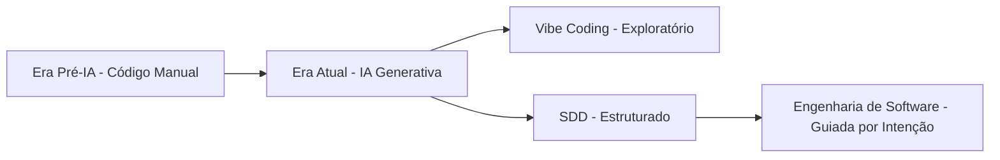
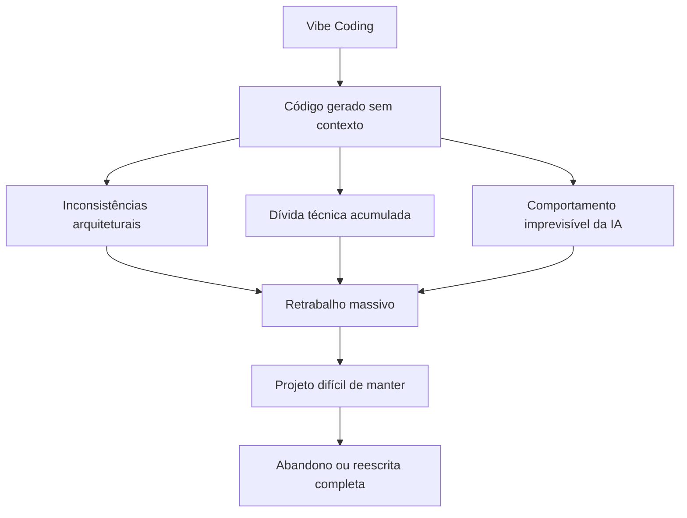
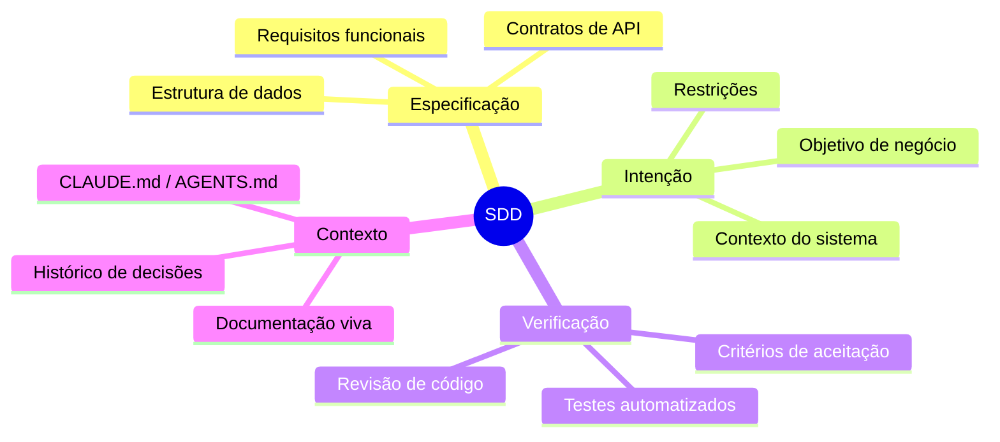
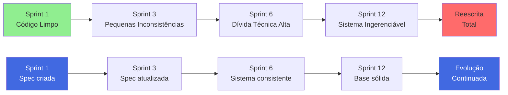
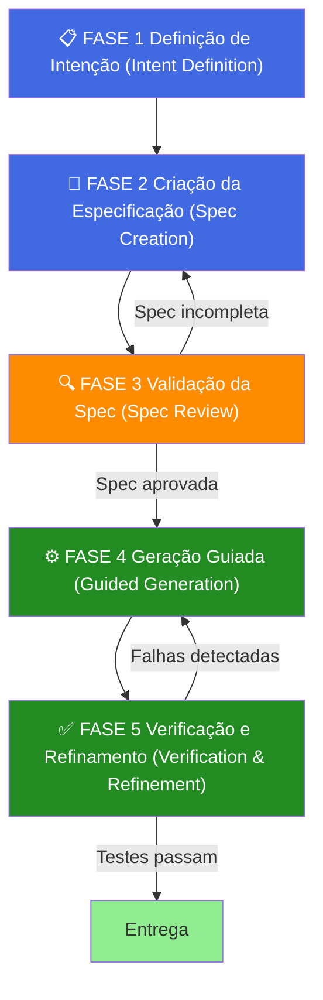
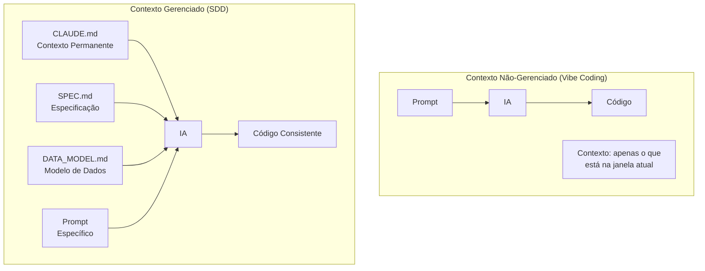
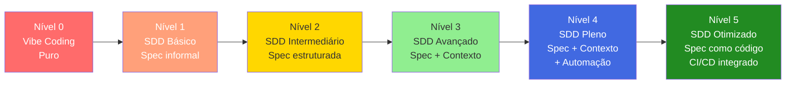
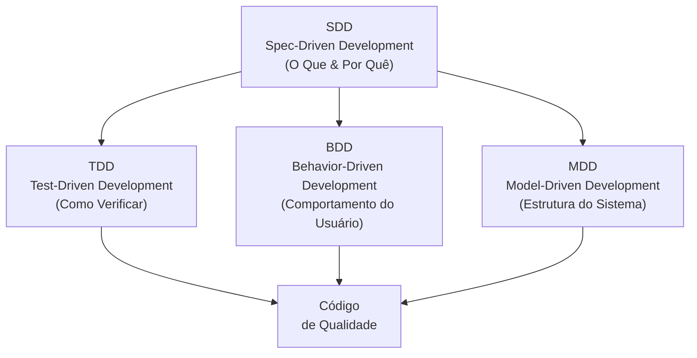
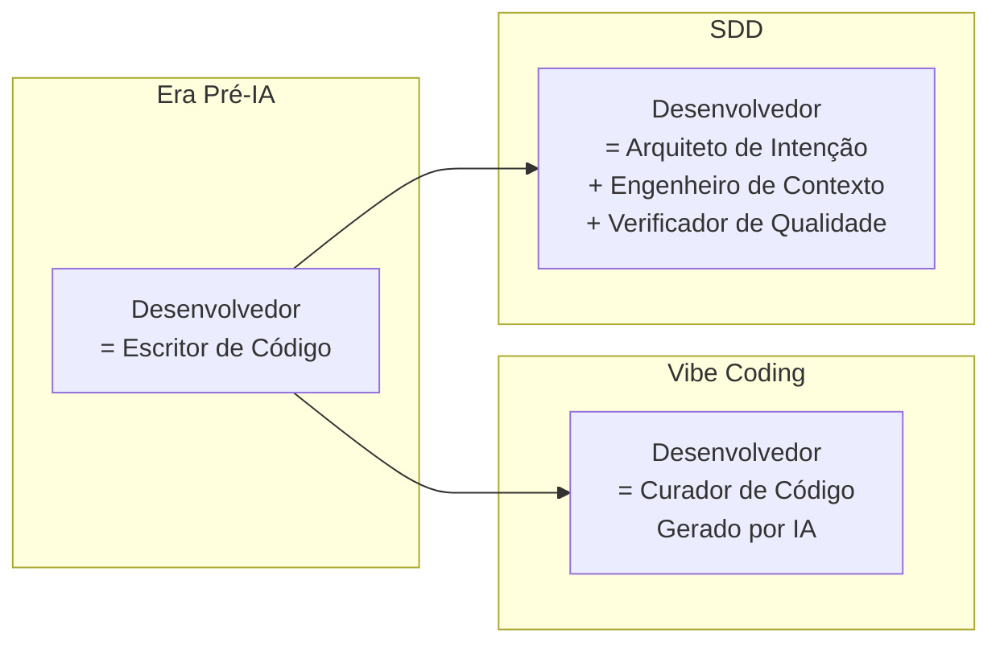
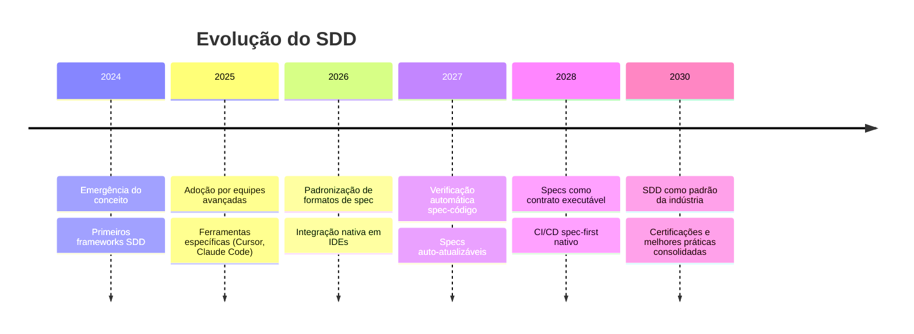

# Vibe Coding vs. Spec-Driven Development (SDD): O Novo Paradigma da Engenharia de Software

> **Curso:** Engenharia de Software Guiada por Intenção e Spec-Driven Development (SDD)
> **Plataforma:** Data Science Academy
> **Data:** Março de 2026

---

## Sumário

1. [O Novo Paradigma da Engenharia de Software](#1-o-novo-paradigma-da-engenharia-de-software)
2. [O Que é Vibe Coding?](#2-o-que-é-vibe-coding)
3. [O Que é Spec-Driven Development (SDD)?](#3-o-que-é-spec-driven-development-sdd)
4. [Comparação: Vibe Coding vs. SDD](#4-comparação-vibe-coding-vs-sdd)
5. [Componentes Fundamentais do SDD](#5-componentes-fundamentais-do-sdd)
6. [O Workflow do SDD em 5 Fases](#6-o-workflow-do-sdd-em-5-fases)
7. [Context Engineering — A Base do SDD](#7-context-engineering--a-base-do-sdd)
8. [Níveis de Maturidade em SDD](#8-níveis-de-maturidade-em-sdd)
9. [SDD vs. TDD vs. BDD vs. MDD](#9-sdd-vs-tdd-vs-bdd-vs-mdd)
10. [Ferramentas do Ecossistema SDD](#10-ferramentas-do-ecossistema-sdd)
11. [SDD na Prática — Exemplos e Casos de Uso](#11-sdd-na-prática--exemplos-e-casos-de-uso)
12. [A Transformação do Papel do Desenvolvedor](#12-a-transformação-do-papel-do-desenvolvedor)
13. [Desafios, Limitações e o Futuro do SDD](#13-desafios-limitações-e-o-futuro-do-sdd)
14. [Conclusão](#14-conclusão)

---

## 1. O Novo Paradigma da Engenharia de Software

A engenharia de software está passando por uma das maiores transformações de sua história. A ascensão dos modelos de linguagem de grande porte (LLMs) e ferramentas de IA generativa mudou fundamentalmente a maneira como o software é concebido, escrito e mantido.

Dois estilos de desenvolvimento emergiram como representativos dessa nova era:

- **Vibe Coding** — desenvolvimento intuitivo, fluido e exploratório com IA
- **Spec-Driven Development (SDD)** — desenvolvimento estruturado e guiado por especificações formais, usando IA de forma disciplinada

Compreender as diferenças entre essas abordagens é essencial para qualquer engenheiro que queira trabalhar de forma eficaz na era da IA.



---

## 2. O Que é Vibe Coding?

O termo **Vibe Coding** foi popularizado pelo pesquisador Andrej Karpathy em 2025 para descrever uma prática em que o desenvolvedor delega amplamente a escrita de código para a IA, interagindo com ela de forma conversacional e intuitiva — sem necessariamente entender em profundidade o código gerado.

### Características do Vibe Coding

| Característica | Descrição |
|---|---|
| **Interação** | Conversacional, baseada em prompts em linguagem natural |
| **Controle** | Baixo — o desenvolvedor aceita o que a IA gera |
| **Documentação** | Inexistente ou mínima |
| **Especificação** | Implícita, na cabeça do desenvolvedor |
| **Testes** | Raros ou ausentes |
| **Velocidade inicial** | Muito alta |
| **Manutenibilidade** | Baixa a médio prazo |
| **Previsibilidade** | Baixa |

### Como Funciona na Prática

```
Desenvolvedor → "Cria pra mim uma API REST de usuários"
     ↓
IA gera código
     ↓
Desenvolvedor → "Agora adiciona autenticação JWT"
     ↓
IA gera mais código
     ↓
Desenvolvedor → "Tá dando erro, conserta"
     ↓
IA tenta corrigir...
     ↓
[Ciclo sem fim de correções reativas]
```

### Quando o Vibe Coding Funciona

O Vibe Coding é genuinamente útil em cenários específicos:

- **Prototipagem rápida** — explorar uma ideia em poucas horas
- **Projetos descartáveis** — scripts one-off, demos, POCs
- **Aprendizado pessoal** — explorar uma nova tecnologia
- **Tarefas simples e isoladas** — geração de dados de teste, scripts de automação simples

### Problemas do Vibe Coding em Produção



---

## 3. O Que é Spec-Driven Development (SDD)?

**Spec-Driven Development (SDD)** é uma metodologia de desenvolvimento de software em que a criação de **especificações formais e estruturadas** precede e guia toda a interação com a IA. É a resposta disciplinada ao caos do Vibe Coding.

No SDD, a IA é tratada como um **executor qualificado**, não como um oráculo criativo. O desenvolvedor mantém o papel de **arquiteto de intenção** — aquele que define o "o quê" e o "porquê" com precisão, deixando o "como" para a IA gerar dentro de limites bem definidos.

### Definição Formal

> "SDD é uma prática de engenharia de software em que especificações estruturadas, escritas antes do código, servem como o contrato primário entre a intenção humana e a execução da IA."

### Pilares do SDD



---

## 4. Comparação: Vibe Coding vs. SDD

### Tabela Comparativa Detalhada

| Dimensão | Vibe Coding | SDD |
|---|---|---|
| **Ponto de partida** | Prompt informal | Especificação formal |
| **Papel do desenvolvedor** | Curador de código gerado | Arquiteto de intenção |
| **Papel da IA** | Co-autor criativo | Executor especializado |
| **Documentação** | Após o fato (se existir) | Antes do código |
| **Testabilidade** | Difícil | Alta (specs = testes) |
| **Previsibilidade** | Baixa | Alta |
| **Escalabilidade** | Não escala | Escala para equipes grandes |
| **Curva de aprendizado** | Baixa | Moderada |
| **Velocidade inicial** | Muito alta | Moderada |
| **Velocidade a longo prazo** | Cai drasticamente | Mantém-se ou aumenta |
| **Governança** | Ausente | Integrada |
| **Rastreabilidade** | Impossível | Total |
| **Adequação a projetos** | POCs, demos | Produção, sistemas críticos |

### Diagrama de Trade-offs ao Longo do Tempo

```
Velocidade
de entrega
    |
    |  VC\
    |     \
    |      \___
    |           \___
    |  SDD            \___________  Vibe Coding
    |    \___
    |        \_______________
    |                        \_______  SDD
    +-----------------------------------------> Tempo
        Sprint 1   Sprint 3   Sprint 6   Sprint 12
```

### O Custo da Entropia

No Vibe Coding, a **entropia do código** cresce exponencialmente:



---

## 5. Componentes Fundamentais do SDD

O SDD é composto por um conjunto de artefatos estruturados que juntos formam o "pacote de especificação" de um projeto.

### 5.1 O Arquivo de Especificação (SPEC.md)

É o coração do SDD. Define o que o sistema deve fazer, antes de qualquer linha de código.

**Estrutura de um SPEC.md:**

```markdown
# Especificação: Sistema de Autenticação de Usuários

## Objetivo
Fornecer autenticação segura via JWT para a API de usuários.

## Requisitos Funcionais
- RF01: O sistema deve autenticar usuários via email e senha
- RF02: O sistema deve emitir tokens JWT com expiração de 24h
- RF03: O sistema deve suportar refresh tokens com expiração de 30 dias
- RF04: O sistema deve invalidar tokens no logout

## Requisitos Não Funcionais
- RNF01: Tempo de resposta < 200ms para autenticação
- RNF02: Senhas devem usar bcrypt com salt de 12 rounds
- RNF03: Tokens devem ser assinados com RS256

## Contratos de API
### POST /auth/login
Request:
  { "email": "string", "password": "string" }
Response 200:
  { "access_token": "string", "refresh_token": "string", "expires_in": 86400 }
Response 401:
  { "error": "invalid_credentials" }

## Critérios de Aceitação
- [ ] Login com credenciais válidas retorna token válido
- [ ] Login com senha errada retorna 401
- [ ] Token expirado retorna 401
- [ ] Logout invalida o token imediatamente

## Decisões Arquiteturais
- Escolhido JWT sobre sessions por ser stateless e compatível com microserviços
- RS256 escolhido sobre HS256 para permitir verificação pública sem expor segredo
```

### 5.2 O Arquivo de Contexto (CLAUDE.md / AGENTS.md)

Fornece contexto permanente para a IA sobre o projeto, suas convenções e restrições.

```markdown
# CLAUDE.md — Contexto do Projeto

## Visão Geral
API REST para gestão de e-commerce. Backend em Python/FastAPI,
banco de dados PostgreSQL, deploy no AWS ECS.

## Padrões de Código
- Use type hints em todas as funções
- Docstrings em formato Google Style
- Testes unitários para toda função de negócio (coverage > 80%)

## Estrutura do Projeto
src/
  api/       → rotas FastAPI
  core/      → lógica de negócio
  models/    → modelos SQLAlchemy
  schemas/   → schemas Pydantic
  tests/     → testes pytest

## Convenções
- Nomes de variáveis em snake_case
- Constantes em UPPER_SNAKE_CASE
- Classes em PascalCase

## Proibições
- NÃO use bibliotecas não listadas em requirements.txt sem perguntar
- NÃO faça commits direto na main
- NÃO use print() para logging — use o módulo logging
```

### 5.3 Estrutura de Dados (DATA_MODEL.md)

Arquivo `DATA_MODEL.md` — exemplo de conteúdo:

**# Modelo de Dados**

**## Entidade: User**

| Campo        | Tipo         | Restrições               |
|--------------|--------------|--------------------------|
| id           | UUID         | PK, gerado pelo sistema  |
| email        | VARCHAR(255) | UNIQUE, NOT NULL         |
| password     | VARCHAR(255) | NOT NULL, bcrypt hash    |
| created_at   | TIMESTAMP    | NOT NULL, DEFAULT NOW()  |
| is_active    | BOOLEAN      | NOT NULL, DEFAULT TRUE   |

### 5.4 Critérios de Aceite (ACCEPTANCE.md)

Define o que significa "pronto" de forma inequívoca, servindo como input direto para testes automatizados. É o contrato entre o que foi especificado e o que será verificado — cada critério deve ser diretamente testável.

**Estrutura de um ACCEPTANCE.md:**

```
# Critérios de Aceite — Sistema de Autenticação

## Feature: Login de Usuário

### CA01 — Login com credenciais válidas
- DADO que o usuário possui conta ativa com email "user@example.com" e senha "Senha@123"
- QUANDO envia POST /auth/login com essas credenciais
- ENTÃO recebe status 200 com access_token e refresh_token no corpo
- E o access_token expira em 24 horas
- E o refresh_token expira em 30 dias

### CA02 — Login com senha incorreta
- DADO que o usuário existe com email "user@example.com"
- QUANDO envia POST /auth/login com senha errada
- ENTÃO recebe status 401
- E o corpo contém { "error": "invalid_credentials" }
- E nenhum token é retornado

### CA03 — Login com email inexistente
- DADO que não existe usuário com email "ghost@example.com"
- QUANDO envia POST /auth/login com esse email
- ENTÃO recebe status 401
- E a mensagem de erro é idêntica ao CA02 (sem vazar informação)

### CA04 — Token expirado é rejeitado
- DADO um access_token válido expirado (simulado)
- QUANDO esse token é usado em qualquer endpoint protegido
- ENTÃO recebe status 401 com { "error": "token_expired" }

### CA05 — Logout invalida o token imediatamente
- DADO um access_token válido e ativo
- QUANDO POST /auth/logout é chamado com esse token
- E em seguida o mesmo token é usado em um endpoint protegido
- ENTÃO recebe status 401, confirmando que o token foi invalidado
```

**Por que o ACCEPTANCE.md é poderoso no SDD:**

- Cada critério mapeia diretamente para um teste automatizado
- Elimina ambiguidade sobre o que "funcionar" significa
- Serve de contrato entre desenvolvedor, QA e stakeholders
- A IA pode gerar os testes automaticamente a partir dos critérios
- Facilita a rastreabilidade: requisito → critério → teste → código

---

## 6. O Workflow do SDD em 5 Fases

O SDD segue um ciclo de 5 fases que garante que a intenção humana seja preservada durante todo o processo de desenvolvimento.



### Fase 1 — Definição de Intenção

O desenvolvedor articula claramente **o que o sistema precisa fazer** e **por que**, antes de qualquer interação com a IA.

**Perguntas a responder:**
- Qual problema de negócio estamos resolvendo?
- Quem são os usuários e quais são seus fluxos?
- Quais são as restrições técnicas não negociáveis?
- Qual é o critério de sucesso?

### Fase 2 — Criação da Especificação

Com a intenção clara, cria-se o documento SPEC.md. Esta fase pode (e deve) usar a IA para **ajudar a escrever a spec**, não o código.

**Exemplo de prompt SDD para gerar spec:**
```
Com base na intenção abaixo, gere um SPEC.md completo
incluindo requisitos funcionais, não funcionais, contratos
de API e critérios de aceitação:

INTENÇÃO: Criar um endpoint de upload de imagens de produto
para um e-commerce. Imagens devem ser redimensionadas para
3 tamanhos (thumbnail 100x100, medium 500x500, full 1200x1200)
e armazenadas no S3. Máximo 5MB por imagem, formatos aceitos:
JPG, PNG, WEBP.
```

### Fase 3 — Validação da Spec

A spec é revisada — pelo time ou por outra sessão de IA — para identificar:
- Ambiguidades
- Requisitos conflitantes
- Casos de borda não cobertos
- Violações de restrições arquiteturais

### Fase 4 — Geração Guiada

Com a spec validada, a IA gera código **referenciando explicitamente** os requisitos:

**Exemplo de prompt SDD para gerar código:**
```
Com base no SPEC.md abaixo e seguindo as convenções do CLAUDE.md,
implemente o endpoint de upload de imagens.

Requisitos obrigatórios a implementar: RF01, RF02, RF03
Critérios de aceite: CA01, CA02, CA03, CA04

[SPEC.md aqui]
[CLAUDE.md aqui]
```

### Fase 5 — Verificação e Refinamento

O código gerado é verificado contra os critérios de aceite. Qualquer desvio retorna para a Fase 4 com contexto explícito sobre o problema.

---

## 7. Context Engineering — A Base do SDD

**Context Engineering** é a disciplina de projetar e gerenciar o contexto fornecido à IA para maximizar a qualidade e consistência das saídas geradas.

No Vibe Coding, o contexto é acidental — a IA trabalha com o que está disponível na janela de contexto atual.

No SDD, o contexto é **intencional e gerenciado**:



### Camadas de Contexto no SDD

| Camada | Arquivo | Propósito | Frequência de Atualização |
|---|---|---|---|
| **Projeto** | CLAUDE.md | Convenções, stack, estrutura | Raramente |
| **Feature** | SPEC.md | Requisitos e contratos | Por feature |
| **Dados** | DATA_MODEL.md | Esquemas e relações | Conforme modelo evolui |
| **Sessão** | Prompt atual | Tarefa específica | A cada interação |

### Técnicas de Context Engineering

1. **Context Layering** — empilhar contexto do mais geral para o mais específico
2. **Spec Injection** — incluir a spec completa em cada prompt de geração
3. **Constraint Anchoring** — sempre mencionar restrições críticas no prompt
4. **Decision Logging** — registrar decisões arquiteturais no CLAUDE.md

---

## 8. Níveis de Maturidade em SDD

O SDD não é binário — existe um espectro de maturidade que equipes podem seguir progressivamente.



### Descrição dos Níveis

**Nível 0 — Vibe Coding Puro**
- Sem specs, sem documentação estruturada
- IA gera código livremente
- Resultado imprevisível

**Nível 1 — SDD Básico**
- Specs informais em comentários ou notas
- Algum contexto fornecido à IA
- Resultados mais consistentes

**Nível 2 — SDD Intermediário**
- SPEC.md estruturado por feature
- CLAUDE.md com convenções do projeto
- Prompts referenciam specs

**Nível 3 — SDD Avançado**
- Stack completo de documentação (SPEC, DATA_MODEL, CLAUDE)
- Revisão de specs antes da geração
- Critérios de aceite mapeados para testes

**Nível 4 — SDD Pleno**
- Specs versionadas junto ao código
- Pipeline de validação de specs
- Rastreabilidade completa requisito → código → teste

**Nível 5 — SDD Otimizado**
- Specs como código (OpenAPI, Protobuf, JSON Schema)
- Geração automatizada em CI/CD
- Métricas de conformidade spec-código

---

## 9. SDD vs. TDD vs. BDD vs. MDD

O SDD não substitui outras metodologias — ele as complementa e as integra num framework coeso.



### Tabela Comparativa

| Metodologia | Foco Principal | Artefato Central | Quem Escreve | Quando Escreve |
|---|---|---|---|---|
| **SDD** | Intenção e especificação | SPEC.md | Dev + Stakeholders | Antes de tudo |
| **TDD** | Comportamento do código | Testes unitários | Desenvolvedor | Antes do código |
| **BDD** | Comportamento do usuário | Cenários Gherkin | Dev + QA + PO | Antes do código |
| **MDD** | Estrutura do sistema | Modelos UML | Arquiteto | Fase de design |

### Como o SDD Integra as Outras Abordagens

No SDD maduro:
- A **SPEC.md** define os requisitos funcionais
- O **BDD** transforma esses requisitos em cenários de usuário
- O **TDD** implementa os testes que verificam esses cenários
- O **MDD** define a estrutura de dados e arquitetura
- A **IA** gera o código que satisfaz todos esses contratos

---

## 10. Ferramentas do Ecossistema SDD

### Ferramentas de IA para SDD

| Ferramenta | Tipo | Uso no SDD |
|---|---|---|
| **Claude Code** | CLI / Agente de IA | Geração guiada por CLAUDE.md |
| **GitHub Copilot** | IDE Plugin | Autocompletar ciente de contexto |
| **Cursor** | IDE com IA | Edição guiada por contexto |
| **Aider** | CLI | Pair programming com spec |
| **Windsurf** | IDE com IA | Fluxo de trabalho orientado a contexto |

### Ferramentas de Especificação

| Ferramenta | Propósito | Integração SDD |
|---|---|---|
| **OpenAPI/Swagger** | Spec de API REST | Gerar código a partir da spec |
| **Protobuf** | Spec de contratos gRPC | Geração de stubs automática |
| **JSON Schema** | Spec de dados | Validação e geração de tipos |
| **AsyncAPI** | Spec de mensageria | Eventos e filas |

### GitHub Spec Kit

O **GitHub Spec Kit** é um conjunto de templates e GitHub Actions que implementa o fluxo SDD diretamente no repositório:

```
repositorio/
├── .github/
│   ├── workflows/
│   │   ├── spec-validate.yml    ← valida specs no PR
│   │   └── spec-generate.yml   ← gera código a partir de specs
│   └── SPEC_TEMPLATE.md        ← template para novas specs
├── specs/
│   ├── auth/
│   │   ├── SPEC.md
│   │   └── ACCEPTANCE.md
│   └── products/
│       ├── SPEC.md
│       └── DATA_MODEL.md
├── CLAUDE.md                   ← contexto global para IA
└── src/
    └── ...
```

---

## 11. SDD na Prática — Exemplos e Casos de Uso

### Exemplo Completo: Feature de Busca de Produtos

#### Passo 1 — Definição de Intenção (sem IA)

```
INTENÇÃO: Implementar busca de produtos no catálogo do e-commerce.
Usuários devem poder buscar por nome, categoria e faixa de preço.
A busca deve ser rápida (< 300ms) e retornar resultados paginados.
```

#### Passo 2 — Criação da Spec (com IA para ajudar)

```markdown
# SPEC: Busca de Produtos

## RF01 — Busca por texto
O endpoint deve aceitar um parâmetro `q` e retornar produtos
cujo nome ou descrição contenha o termo buscado.

## RF02 — Filtro por categoria
Parâmetro `category_id` (opcional) filtra por categoria.

## RF03 — Filtro por preço
Parâmetros `min_price` e `max_price` (opcionais, em centavos).

## RF04 — Paginação
Parâmetros `page` (default: 1) e `limit` (default: 20, max: 100).

## Contrato de API
GET /products/search?q=camiseta&category_id=5&min_price=2000&max_price=10000&page=1&limit=20

Response 200:
{
  "data": [
    {
      "id": "uuid",
      "name": "string",
      "price": "integer (centavos)",
      "category": "string",
      "thumbnail_url": "string"
    }
  ],
  "pagination": {
    "page": 1,
    "limit": 20,
    "total": 150,
    "pages": 8
  }
}

## Critérios de Aceite
- CA01: Busca por "camiseta" retorna apenas produtos com "camiseta" no nome ou descrição
- CA02: Filtro de categoria retorna apenas produtos da categoria especificada
- CA03: Filtro de preço retorna apenas produtos dentro da faixa
- CA04: Resposta em menos de 300ms para qualquer combinação de filtros
- CA05: Paginação funciona corretamente
- CA06: Termo vazio retorna todos os produtos (respeitando outros filtros)
```

#### Passo 3 — Geração do Código (com IA)

```
Prompt: "Com base no SPEC.md abaixo e nas convenções do CLAUDE.md,
implemente o endpoint GET /products/search em FastAPI com SQLAlchemy.
Implemente RF01, RF02, RF03 e RF04. Inclua testes pytest para CA01-CA06."

[SPEC.md + CLAUDE.md inseridos aqui]
```

#### Passo 4 — Resultado: Código Previsível e Testável

```python
# Código gerado pela IA, guiado pela spec
from fastapi import APIRouter, Query, Depends
from sqlalchemy.orm import Session
from typing import Optional
from .schemas import ProductSearchResponse
from .services import search_products_service

router = APIRouter()

@router.get("/products/search", response_model=ProductSearchResponse)
async def search_products(
    q: Optional[str] = Query(None, description="Termo de busca"),     # RF01
    category_id: Optional[int] = Query(None),                          # RF02
    min_price: Optional[int] = Query(None, ge=0),                      # RF03
    max_price: Optional[int] = Query(None, ge=0),                      # RF03
    page: int = Query(1, ge=1),                                         # RF04
    limit: int = Query(20, ge=1, le=100),                               # RF04
    db: Session = Depends(get_db)
):
    """Busca produtos com filtros opcionais. Refs: RF01, RF02, RF03, RF04"""
    return await search_products_service(
        db=db, q=q, category_id=category_id,
        min_price=min_price, max_price=max_price,
        page=page, limit=limit
    )
```

### Diferença com Vibe Coding

No Vibe Coding, o mesmo endpoint seria gerado com um prompt como:
```
"Cria um endpoint de busca de produtos"
```

O resultado:
- Sem paginação (esquecida)
- Sem validação de `limit` máximo
- Busca apenas por nome (sem descrição)
- Sem testes
- Sem rastreabilidade aos requisitos
- Nome dos campos inconsistente com o resto da API

---

## 12. A Transformação do Papel do Desenvolvedor

O SDD não elimina o desenvolvedor — ele **eleva** seu papel.



### Novas Habilidades do Engenheiro SDD

| Habilidade | Descrição |
|---|---|
| **Especificação formal** | Escrever specs claras, precisas e sem ambiguidades |
| **Context Engineering** | Gerenciar contexto fornecido à IA estrategicamente |
| **Prompt Engineering** | Formular prompts que referenciam specs explicitamente |
| **Verificação crítica** | Avaliar código gerado contra spec, não apenas "parece certo" |
| **Governança de IA** | Estabelecer guardrails e limites para geração de código |
| **Pensamento sistêmico** | Manter visão de todo o sistema enquanto trabalha em partes |

### O Desenvolvedor como "Engenheiro de Intenção"

No SDD, o desenvolvedor passa a maior parte do tempo **antes** da geração de código:

```
Distribuição de tempo — Vibe Coding:
  10% — Pensar na solução
  20% — Escrever prompts
  70% — Depurar e corrigir código gerado

Distribuição de tempo — SDD:
  40% — Definir intenção e escrever spec
  20% — Revisar e validar spec
  20% — Gerar e verificar código
  20% — Testes e refinamento
```

---

## 13. Desafios, Limitações e o Futuro do SDD

### Desafios do SDD

**1. Overhead Inicial**
Escrever uma boa spec leva tempo. Em projetos de curtíssimo prazo, esse overhead pode ser percebido como improdutivo.

**2. Resistência Cultural**
Times acostumados ao Vibe Coding podem resistir à disciplina do SDD. "Por que documentar se a IA gera rápido?"

**3. Specs Desatualizadas**
Quando o código evolui sem atualizar a spec, ela perde valor. É preciso disciplina para manter a spec como fonte de verdade.

**4. Complexidade da Especificação**
Sistemas muito complexos exigem specs grandes. Gerenciar essa complexidade requer ferramentas e processos adequados.

**5. Dependência da Qualidade da Spec**
Se a spec é ambígua ou incompleta, o código gerado será igualmente problemático. Garbage in, garbage out.

### Limitações Atuais

| Limitação | Impacto | Mitigação |
|---|---|---|
| LLMs podem ignorar partes da spec | Baixa conformidade | Verificação explícita pós-geração |
| Janela de contexto finita | Specs grandes não cabem no contexto | Modularização da spec |
| Specs complexas são difíceis de escrever | Adoção lenta | Templates e ferramentas de apoio |
| Falta de padrões universais | Fragmentação | GitHub Spec Kit, OpenAPI |

### O Futuro do SDD



**Tendências emergentes:**
- **Spec-as-Code** — specs em formatos executáveis como OpenAPI, GraphQL Schema, Protobuf
- **AI Spec Verification** — IA que verifica se o código implementado está em conformidade com a spec
- **Living Documentation** — specs que se atualizam automaticamente conforme o código evolui
- **Multi-Agent SDD** — múltiplos agentes IA com papéis distintos (especificador, implementador, verificador)

---

## 14. Conclusão

O Vibe Coding e o SDD representam dois extremos de uma escala de disciplina no desenvolvimento de software assistido por IA.

O **Vibe Coding** é poderoso para exploração rápida, prototipagem e tarefas isoladas — contextos onde a velocidade supera a necessidade de manutenibilidade.

O **SDD** é a abordagem correta para software de produção, sistemas críticos e projetos que precisam escalar — contextos onde a previsibilidade, rastreabilidade e qualidade são não-negociáveis.

A pergunta não é "qual é melhor?", mas **"qual é adequado para este contexto?"** Um engenheiro de software maduro na era da IA sabe quando explorar com liberdade e quando trabalhar com disciplina.

### Princípios para Adotar SDD

1. **Spec primeiro, código depois** — nunca comece a gerar código sem uma spec, por mais simples que seja
2. **A IA é um executor, não um arquiteto** — você define o "o quê", a IA implementa o "como"
3. **Contexto é rei** — quanto melhor o contexto fornecido à IA, melhor o código gerado
4. **Specs são código vivo** — atualize a spec quando o código muda, e vice-versa
5. **Verifique, não confie** — sempre valide o código gerado contra os critérios de aceite da spec
6. **Comece simples, evolua** — não tente implementar o Nível 5 de imediato; suba os degraus gradualmente

### A Metáfora Final

> O Vibe Coding é como improvisar jazz: criativo, fluido e imprevisível.
> Perfeito para uma jam session explorativa.
>
> O SDD é como uma orquestra sinfônica: cada músico segue a partitura
> (a spec), mas há espaço para interpretação dentro da estrutura definida.
>
> Para um concerto de gala — seu software em produção — você quer
> a orquestra. Para experimentar uma melodia nova — seu próximo POC —
> o jazz pode ser perfeito.

---

## Referências e Recursos

- Data Science Academy — Curso: Engenharia de Software Guiada por Intenção e SDD
- Karpathy, A. (2025). "The Vibe Coding Manifesto"
- GitHub Spec Kit — Templates e workflows para SDD
- OpenAPI Specification — [spec.openapis.org](https://spec.openapis.org)
- Anthropic. (2024). "Claude Code Documentation" — Context management and CLAUDE.md
- Brown, T. et al. (2020). "Language Models are Few-Shot Learners" — Base teórica para prompt engineering

---

*Artigo criado com base no curso "Engenharia de Software Guiada por Intenção e Spec-Driven Development (SDD)" da Data Science Academy.*

*Os diagramas neste documento utilizam a sintaxe [Mermaid](https://mermaid.js.org/) e podem ser renderizados em qualquer editor compatível (GitHub, Obsidian, VS Code com extensão).*
